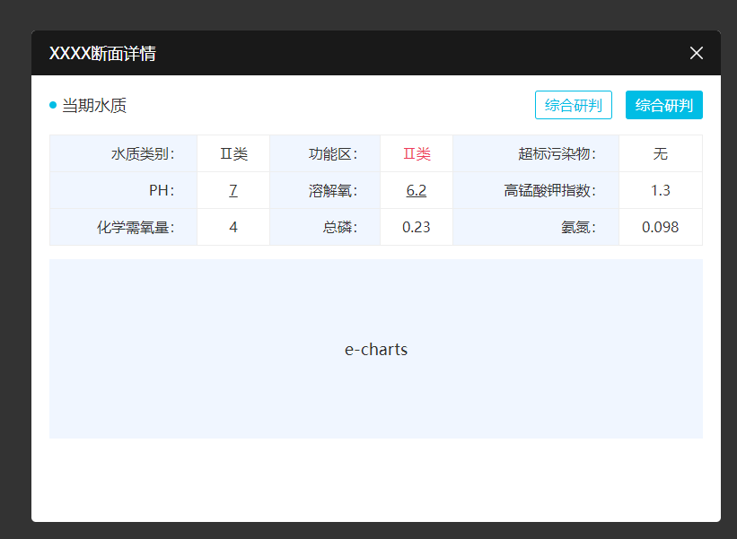

## 断面详情



```html
    <div class="bw-alert" style="width: 768px;height: 548px;">
        <div class="bw-alert-hd">
            <p class="til">XXXX断面详情</p>
            <i class="bw-alert-close"></i>
        </div>
        <div class="bw-alert-bd" style="padding: 0 20px;">
            <div class="gap" style="height: 15px;"></div>
            <div class="bw-duanmian1">
                <div class="flx1 ac jb">
                    <p class="dw1-til1">当期水质</p>
                    <ul class="dw1-tabs1">
                        <li>综合研判</li>
                        <li class="on">综合研判</li>
                    </ul>
                </div>
            </div>

            <div class="gap" style="height: 15px;"></div>
            <table class="dw1-table1">
                <tr>
                    <td class="td-hd">水质类别：</td>
                    <td>Ⅱ类</td>
                    <td class="td-hd">功能区：</td>
                    <td style="color: #ee3b5b;">Ⅱ类</td>
                    <td class="td-hd">超标污染物：</td>
                    <td>无</td>
                </tr>
                <tr>
                    <td class="td-hd">PH：</td>
                    <td><u>7</u></td>
                    <td class="td-hd">溶解氧：</td>
                    <td><u>6.2</u></td>
                    <td class="td-hd">高锰酸钾指数：</td>
                    <td>1.3</td>
                </tr>
                <tr>
                    <td class="td-hd">化学需氧量：</td>
                    <td>4</td>
                    <td class="td-hd">总磷：</td>
                    <td>0.23</td>
                    <td class="td-hd">氨氮：</td>
                    <td>0.098</td>
                </tr>
            </table>
            <div class="gap" style="height: 15px;"></div>
            <div style="height:200px;background:#f0f6ff;font-size: 18px;color: #333;line-height: 200px;text-align: center;">e-charts</div>
        </div>
    </div>
``` 
```css 
.bw-alert {
    position: absolute;
    left: 50%;
    top: 50%;
    transform: translate(-50%, -50%);
    background: #fff;
    z-index: 1000;
    border-radius: 5px;
    overflow: hidden;
}

.bw-alert-hd {
    height: 50px;
    background: #191919;
    display: flex;
    justify-content: space-between;
    align-items: center;
    padding: 0 20px;
}

.bw-alert-hd .til {
    font-size: 18px;
    color: #fff;
    line-height: 50px;
}

.bw-alert-close {
    width: 14px;
    height: 14px;
    cursor: pointer;
    background: url(../images/dlgcls.png) no-repeat center;
}

.bw-alert-bd {
    position: absolute;
    left: 0;
    top: 50px;
    bottom: 0;
    right: 0;
}

.dw1-til1 {
    position: relative;
    padding-left: 14px;
    font-size: 18px;
    color: #333;
    line-height: 36px;
}

.dw1-til1::after {
    content: "";
    position: absolute;
    left: 0;
    top: 50%;
    transform: translateY(-50%);
    width: 8px;
    height: 8px;
    background-color: #00bde5;
    border-radius: 50%;
}

.dw1-tabs1 {
    display: flex;
}

.dw1-tabs1 li {
    border: 1px solid #00bde5;
    border-radius: 3px;
    padding: 0 10px;
    font-size: 16px;
    color: #00bde5;
    line-height: 30px;
    cursor: pointer;
}

.dw1-tabs1 li+li {
    margin-left: 15px;
}

.dw1-tabs1 li.on {
    background: #00bde5;
    color: #fff;
}

.dw1-table1 {
    width: 100%;
    border: 1px solid #eee;
}

.dw1-table1 td {
    font-size: 16px;
    color: #333;
    text-align: center;
    height: 40px;
    border: 1px solid #eee;
    padding: 0 15px;
}

.dw1-table1 td.td-hd {
    text-align: right;
    background: #f0f6ff;
}
```