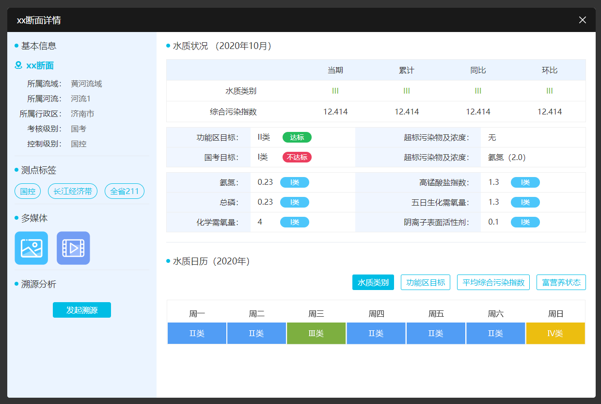

## 断面详情2



```html
<div class="bw-alert"style="width: 1214px;height: 804px;"><div class="bw-alert-hd"><p class="til">xx断面详情</p><i class="bw-alert-close"></i></div><div class="bw-alert-bd"><div class="bw-duanmian2"><div class="lpart"><div class="gap"></div><p class="dw2-til1">基本信息</p><div class="gap"></div><div class="dw2-til2">xx断面</div><div class="gap"></div><table class="dw2-table1"><colgroup><col width="40%"></colgroup><tbody><tr><td class="td-hd">所属流域：</td><td>黄河流域</td></tr><tr><td class="td-hd">所属河流：</td><td>河流1</td></tr><tr><td class="td-hd">所属行政区：</td><td>济南市</td></tr><tr><td class="td-hd">考核级别：</td><td>国考</td></tr><tr><td class="td-hd">控制级别：</td><td>国控</td></tr></tbody></table><div class="gap"style="border-bottom: 1px solid #e4e9f0;"></div><div class="gap"></div><p class="dw2-til1">测点标签</p><div class="gap"></div><ul class="dw2-labels"><li>国控</li><li>长江经济带</li><li>全省211</li></ul><div class="gap"></div><div class="gap"style="border-top: 1px solid #e4e9f0;"></div><p class="dw2-til1">多媒体</p><div class="gap"></div><div class="dw2-data1"></div><div class="gap "></div><div class="gap"style="border-top: 1px solid #e4e9f0;"></div><p class="dw2-til1">溯源分析</p><div class="gap"></div><div class="gap"></div><button class="dw2-btn1">发起溯源</button></div><div class="rpart"><div class="gap"></div><p class="dw2-til1">水质状况（2020年10月）</p><div class="gap"></div><table class="dw2-table2"><thead><tr><td></td><td>当期</td><td>累计</td><td>同比</td><td>环比</td></tr></thead><tbody><tr><td>&emsp;&emsp;水质类别</td><td style="color: #75bb35;">III</td><td style="color: #75bb35;">III</td><td style="color: #75bb35;">III</td><td style="color: #75bb35;">III</td></tr><tr><td>综合污染指数</td><td>12.414</td><td>12.414</td><td>12.414</td><td>12.414</td></tr></tbody></table><div class="gap"></div><table class="dw2-table3"><colgroup><col width="20%"/><col width="25%"/><col width="30%"/><col width="25%"/></colgroup><tr><td class="td-hd">功能区目标：</td><td><em class="wdh">II类</em><span class="type"style="background-color: #25bc5d;">达标</span></td><td class="td-hd">超标污染物及浓度：</td><td>无</td></tr><tr><td class="td-hd">国考目标：</td><td><em class="wdh">I类</em><span class="type"style="background-color: #eb3e5e;">不达标</span></td><td class="td-hd">超标污染物及浓度：</td><td>氨氮（2.0）</td></tr></table><div class="gap"></div><table class="dw2-table3"><colgroup><col width="20%"/><col width="25%"/><col width="30%"/><col width="25%"/></colgroup><tr><td class="td-hd">氨氮：</td><td><em class="wdh">0.23</em><span class="level"style="background-color: #4cc6fa;">I类</span></td><td class="td-hd">高锰酸盐指数：</td><td><em class="wdh">1.3</em><span class="level"style="background-color: #4cc6fa;">I类</span></td></tr><tr><td class="td-hd">总磷：</td><td><em class="wdh">0.23</em><span class="level"style="background-color: #4cc6fa;">I类</span></td><td class="td-hd">五日生化需氧量：</td><td><em class="wdh">1.3</em><span class="level"style="background-color: #4cc6fa;">I类</span></td></tr><tr><td class="td-hd">化学需氧量：</td><td><em class="wdh">4</em><span class="level"style="background-color: #4cc6fa;">I类</span></td><td class="td-hd">阴离子表面活性剂：</td><td><em class="wdh">0.1</em><span class="level"style="background-color: #4cc6fa;">I类</span></td></tr></table><div class="gap"></div><div class="gap"></div><div class="gap"style="border-top: 1px solid #e4e9f0;"></div><div class="gap"></div><p class="dw2-til1">水质日历（2020年）</p><div class="gap"></div><div class="flx1 end"><ul class="dw2-tabs1"><li class="on">水质类别</li><li>功能区目标</li><li>平均综合污染指数</li><li>富营养状态</li></ul></div><div class="gap"></div><div class="gap"></div></div></div></div></div>
``` 
```css 
.bw-alert {position: absolute;left: 50%;top: 50%;transform: translate(-50%, -50%);background: #fff;z-index: 1000;border-radius: 5px;overflow: hidden;}.bw-alert-hd {height: 50px;background: #191919;display: flex;justify-content: space-between;align-items: center;padding: 0 20px;}.bw-alert-hd .til {font-size: 18px;color: #fff;line-height: 50px;}.bw-alert-close {width: 14px;height: 14px;cursor: pointer;background: url(../images/dlgcls.png) no-repeat center;}.bw-alert-bd {position: absolute;left: 0;top: 50px;bottom: 0;right: 0;}.bw-duanmian2 {display: flex;height: 100%;}.bw-duanmian2 .lpart {width: 308px;height: 100%;background: #ebf4ff;padding: 0 15px;box-sizing: border-box;}.bw-duanmian2 .rpart {flex: 1;height: 100%;padding: 0 20px;}.dw2-til1 {position: relative;padding-left: 14px;font-size: 18px;color: #333;line-height: 36px;}.dw2-til1::after {content: "";position: absolute;left: 0;top: 50%;transform: translateY(-50%);width: 8px;height: 8px;background-color: #00bde5;border-radius: 50%;}.dw2-til2 {background: url(../images/dw2_til2.png) no-repeat left center;padding-left: 24px;font-size: 18px;color: #00bde5;font-weight: bold;}.dw2-table1 {width: 100%;}.dw2-table1 td {font-size: 16px;color: #666;padding: 3px 5px;height: 25px;}.dw2-table1 td.td-hd {text-align: right;color: #333;}.dw2-labels {display: flex;}.dw2-labels li {border: 1px solid #00bde5;border-radius: 16px;padding: 0 10px;font-size: 16px;color: #00bde5;line-height: 30px;cursor: pointer;}.dw2-labels li+li {margin-left: 15px;}.dw2-data1 {display: flex;}.dw2-data1 img+img {margin-left: 18px;}.dw2-btn1 {display: block;width: 120px;margin: 0 auto;height: 32px;border: 1px solid #00bde5;font-size: 16px;text-align: center;line-height: 30px;border-radius: 4px;background: #00bde5;color: #fff;cursor: pointer;}.dw2-table2 {width: 100%;border: 1px solid #eee;}.dw2-table2 tr td {font-size: 16px;color: #333;text-align: center;height: 40px;border-bottom: 1px solid #eee;}.dw2-table2 thead tr td {background: #ebf4ff;}.dw2-table3 {width: 100%;border: 1px solid #eee;}.dw2-table3 tr td {font-size: 16px;color: #333;height: 40px;border-bottom: 1px solid #eee;padding: 0 15px;}.dw2-table3 td.td-hd {text-align: right;background: #f0f6ff;}.dw2-table3 td .wdh {display: inline-block;width: 25%;}.dw2-table3 td .type {display: inline-block;width: 60px;height: 22px;border-radius: 12px;font-size: 14px;color: #fff;text-align: center;line-height: 22px;}.dw2-table3 td .level {display: inline-block;width: 60px;height: 22px;border-radius: 12px;font-size: 14px;color: #fff;text-align: center;line-height: 22px;}.dw2-tabs1 {display: flex;}.dw2-tabs1 li {border: 1px solid #00bde5;border-radius: 3px;padding: 0 10px;font-size: 16px;color: #00bde5;line-height: 30px;cursor: pointer;}.dw2-tabs1 li+li {margin-left: 14px;}.dw2-tabs1 li.on {background: #00bde5;color: #fff;}
```